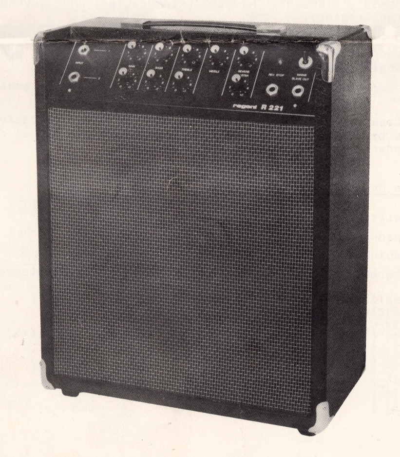

# Regent 221

This repo is a proof-of-concept of making a neural model of an amp from a SPICE model.

The specimen here is the Regent 221 combo apmplifier from GDR. We will use a NAM model to simulate the preamp section of this amp. The EQ bit is omitted from simulation. As it's a classic tone stack circuit, it's trivial to implement in DSP.

SPICE simulation can be run from KiCAD or with ngspice directly.

## SPICE simulation file structure

* `preamp/BC.CIR` 
    Models for BC238 and BC239 NPN transistors used in the preamp.
* `preamp/FILE.CIR`     
     Filesource model to load PWL data.
* `preamp/inputvalues`
    PWL data generated with `wavtospice.py` script.
* `preamp/output`
    SPICE simulation output.
* `preamp/preamp.cir`
    Preamp model generated from KiCAD schematic.
* `preamp/preamp.kicad_sch`
    KiCAD schematic

## Workflow

1. Run `wavtospice.py` script. It will convert `input.wav` file to a SPICE-compatible CSV and write the result to `preamp/inputvalues`
2. Run SPICE simulation with KiCAD (`preamp/preamp.kicad_sch`) or ngspice (`preamp/preamp.cir`). Simulation result will be written to `preamp/output`.
3. Run `spicetowav.py` script. It will convert `preamp/output` CSV file to WAV and write the result to `output.wav`.
4. Use this output to train a model?